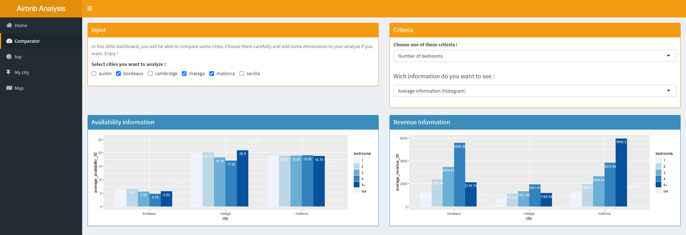
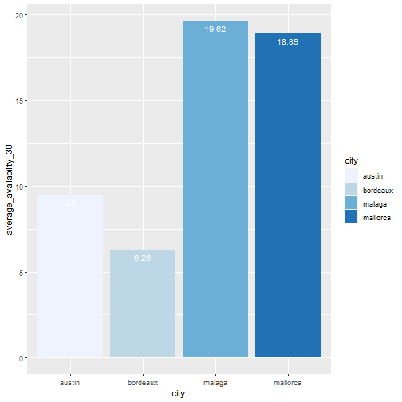
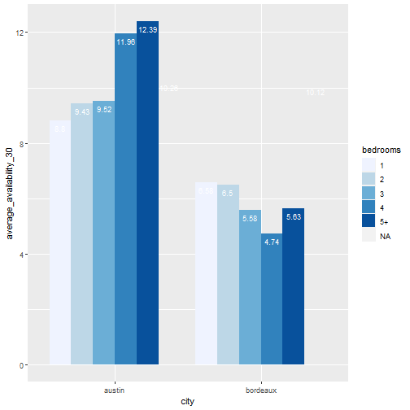
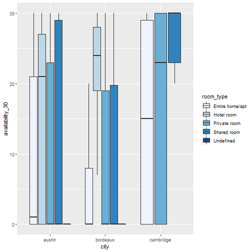
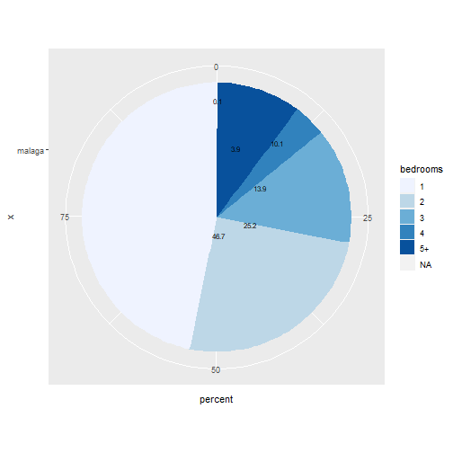

AirBnb Data analytics
========================================================
author: Bastien Vendrame, Raphael Partouche, Ramzi Agougile
date: 26/11/2020
autosize: true


Introduction
========================================================

**Information about the project :**
 
- Language : R

- Shiny application


- Ui/Server application


- Airbnb data from : http://insideairbnb.com/ 


Airbnb Data
========================================================
**Where ?**
- Different places : France (Bordeaux), USA(Cambridge, Austin), Spain (Mallorca, Sevilla, Malaga)

**When ?**

- The last 3 dates from the website

**What ?**
- Information : availabitlity, revenue, price, location, neighbourhood, URL
- Features : room type (hotel, appartment), number of bedrooms, neighbouhood etc.

So first, lets have a look and the app's structure : 


Structure
========================================================

  


Features selection
========================================================
  

Availability
========================================================


+ ggplot() 
+ geom_bar() 
+ geom_text() 
+ scale_fill_brewer(palette="Blues")

```r
plot(p)
```



Availability with features :
========================================================


+ ggplot(fill=bedrooms) 
+ geom_bar() 
+ geom_text() 
+ scale_fill_brewer(palette="Blues")

```r
plot(p2)
```



Other graphics :
========================================================

**Boxplot :**


+ ggplot()
+ geom_boxplot() 
+ scale_y_continuous() 
+ scale_fill_brewer(palette="Blues")

```r
plot(p3)
```



Other graphics :
========================================================

**Lets call it** ***Cheese graphic*** :


+ ggplot() 
+ geom_bar()
+ geom_text()
+ coord_polar("y", start=0) 
+ scale_fill_brewer(palette="Blues")

```r
plot(pie)
```



Leaflet Map :
========================================================


