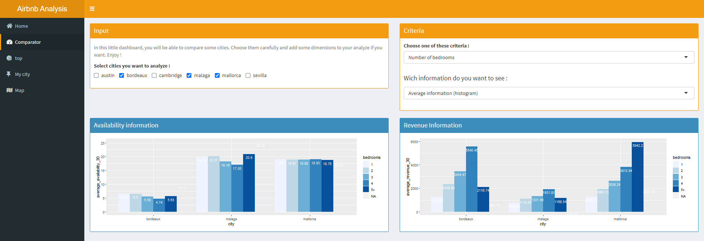

AirBnb Data analytics
========================================================
author: Bastien Vendrame, Raphael Partouche, Ramzi Agougile
date: 26/11/2020
autosize: true


Introduction
========================================================

Information about the project :

- Shiny application
- Airbnb data from : http://insideairbnb.com/ 
- Different places : France (Bordeaux), USA(Cambridge, Austin), Spain (Mallorca, Sevilla, Malaga)
- 3 dates for each city
- Information : availabitlity, revenue, price, location, neighbourhood, URL
- Features : room type (hotel, appartment), number of bedrooms, neighbouhood etc.

So first, lets have a look and the app's structure : 


Structure
========================================================

  


Features selection
========================================================
  

Information available
========================================================
- Availability :


```r
plot(p)
```


Information available
========================================================
- Availability with features :


```r
plot(p2)
```


